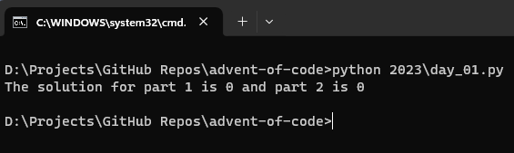

# Advent of Code

## Table of Contents
- [Overview](#overview)
- [Results](#results)
- [Getting Started](#getting-started)
  * [Prerequisites](#prerequisites)
  * [Running Code](#running-code)
  * [Screenshots](#screenshots)
- [Acknowledgments](#acknowledgments)
- [About Chingu](#about-chingu)

## Overview

This repo contains my solutions to the [AdventOfCode](https://adventofcode.com/) problems using [Python3](https://www.python.org/). The challenge is attempted to take part in the [Chingu 2023 Holiday Hackathon](https://wwww.chingu.io/) event.

## Results

- [Day 01](2023/day_01.py): ⭐️⭐️
- [Day 02](2023/day_02.py): ⭐️⭐️
- [Day 03](2023/day_03.py): ⭐️⭐️
- [Day 04](2023/day_04.py): ⭐️⭐️
- [Day 05](2023/day_05.py): ⭐️⭐️
- [Day 06](2023/day_06.py): ⭐️⭐️
- [Day 07](2023/day_07.py): ⭐️⭐️
- [Day 08](2023/day_08.py): ⭐️⭐️
- [Day 09](2023/day_09.py): ⭐️⭐️
- [Day 10](2023/day_10.py): ⭐️⭐️
- [Day 11](2023/day_11.py): ⭐️⭐️
- [Day 12](2023/day_12.py): ⭐️⭐️
- [Day 13](2023/day_13.py): ⭐️⭐️
- [Day 14](2023/day_14.py): ⭐️⭐️
- [Day 15](2023/day_15.py): ⭐️⭐️
- [Day 16](2023/day_16.py): ⭐️⭐️
- [Day 17](2023/day_17.py): ⭐️⭐️
- [Day 18](2023/day_18.py): ⭐️⭐️
- [Day 19](2023/day_19.py): ⭐️⭐️

## Getting Started

These instructions will help you run the code in your local environment.

### Prerequisites

Before starting, you need to install the following on your computer.

[](https://www.python.org/downloads/)
[](https://git-scm.com/downloads)

### Running Code

1. **Clone the repository**
    ```bash
    git clone https://github.com/itzmidinesh/advent-of-code.git
    ```
2. Run `cd advent-of-code` to change the working directory.
3. Place the input data from [AdventOfCode](https://adventofcode.com/) into the file `input.txt`.
4. Run the following in your terminal or command prompt to run the script. 
    ```python
    python 2023\day_xx
    ```
    Note: Replace xx with the day of the challenge you are trying to solve. i.e., 01, 02, etc.
5. The solution for both parts of the challenge for the day would be printed in the terminal.

### Screenshots
Here is an example screenshot of how to run the script in the terminal/command prompt.



## Acknowledgments

Heartfelt thanks to [Eric Wastl](https://was.tl/) for creating the brilliant [AdventOfCode](https://adventofcode.com/) platform, where the joy of coding meets festive challenges. Immense gratitude to the dedicated [sponsors](https://adventofcode.com/2023/sponsors) whose support makes the magic of [AdventOfCode](https://adventofcode.com/) possible.

## About Chingu

This repo was made for [Chingu 2023 Holiday Hackathon](https://wwww.chingu.io/).
If you aren’t yet a member of Chingu we invite you to join us. We help our members transform what they’ve learned in courses & tutorials into the practical experience employers need and want.